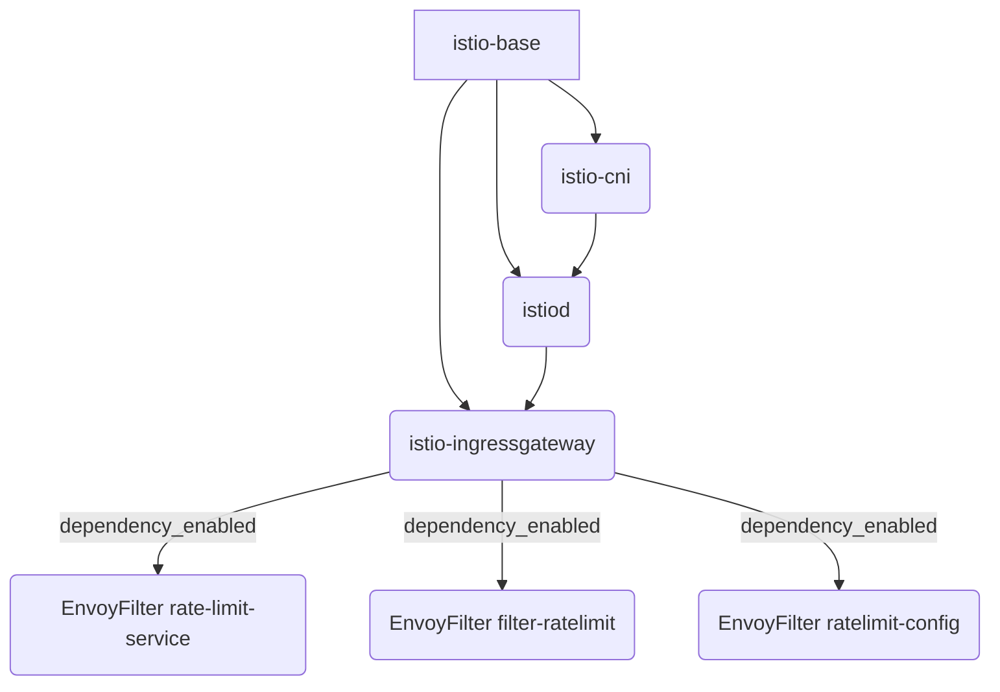

# Contributing Complex Infrastructure as Code (IaC) Components

This guide outlines best practices and patterns for implementing more complex Infrastructure as Code (IaC) components within this project, particularly those involving multiple resources (like Helm charts or Kubernetes manifests), dependencies, and conditional logic. This applies to both Pulumi (Go) and Terraform (HCL) implementations.

## Key Patterns for Complex Components

When building components that go beyond deploying a single resource (like a Helm chart), consider the following patterns:

1.  **Multiple Resources per Component**:
    *   **Problem**: A logical infrastructure component (like a service mesh or monitoring stack) might consist of several distinct resources (e.g., multiple Helm charts, Kubernetes manifests, cloud resources) that need to be deployed and managed together.
    *   **Pulumi (Go) Solution**: Deploy each resource using helpers like `resources.DeployHelmChart` or `resources.CreateK8sManifest` within the same component deployment function (e.g., `DeployIstio`). Assign meaningful variable names to each deployed resource.
    *   **Terraform (HCL) Solution**: Define multiple `resource` blocks (e.g., multiple `helm_release` blocks or `kubernetes_manifest` blocks) within the same logical grouping or module. Use descriptive resource names (e.g., `helm_release.istio_base`, `helm_release.istiod`).

2.  **Intra-Component Dependencies**:
    *   **Problem**: Sub-components often have strict deployment order requirements (e.g., `istiod` requires `istio-base` to be ready).
    *   **Pulumi (Go) Solution**: Use `pulumi.DependsOn([]pulumi.Resource{dependency1, dependency2, ...})` as an option when creating a resource. Pass the variables representing the prerequisite resources into the `DependsOn` slice.
    *   **Terraform (HCL) Solution**: Use the `depends_on` meta-argument within a `resource` block: `depends_on = [helm_release.istio_base, helm_release.istio_cni]`. This explicitly tells Terraform to wait for the dependencies to be successfully provisioned before proceeding with the current resource.

3.  **Conditional Logic**:
    *   **Problem**: Sometimes, parts of a component should only be deployed if a specific feature or related component is enabled via configuration.
    *   **Pulumi (Go) Solution**: Retrieve configuration flags using `utils.NewConfig(ctx).GetBool("feature_flag_name", false)`. Use standard Go `if` statements to wrap the resource creation logic.
    *   **Terraform (HCL) Solution**: Use the `count` meta-argument on resources. Set `count = var.feature_enabled ? 1 : 0`. If the condition (`var.feature_enabled`) is true, one instance of the resource is created; otherwise, zero instances are created, effectively disabling it.

4.  **Raw Kubernetes Manifests**:
    *   **Problem**: Helm might not cover all necessary configurations, especially for Custom Resources (CRs) or specific Kubernetes objects not managed by a chart.
    *   **Pulumi (Go) Solution**: Use `resources.CreateK8sManifest` to deploy resources directly from YAML strings. Construct the YAML string dynamically in Go if needed. Ensure `pulumi.DependsOn` is used if the manifest relies on other resources.
    *   **Terraform (HCL) Solution**: Use the `kubernetes_manifest` resource type (from the `hashicorp/kubernetes` provider). Define the manifest content inline or load from a file/template. Ensure `depends_on` is used if the manifest relies on other resources.

5.  **Inter-Component Dependencies**:
    *   **Problem**: A component might rely on services provided by another independently deployed component (e.g., application needing a database, service mesh needing Redis for rate limiting).
    *   **Pulumi (Go) Solution**: Typically handled implicitly through Kubernetes service discovery (using standard service DNS names) or explicitly by passing configuration values (outputs from one component to inputs of another) via Pulumi stack references or configuration. Conditional logic (point 3) is often essential to only enable features if the dependency is configured.
    *   **Terraform (HCL) Solution**: Similar to Pulumi, dependencies can be implicit via Kubernetes service discovery. Explicit dependencies can be handled by passing output values from one module/resource to the variables/inputs of another. Conditional logic using `count` (point 3) is crucial for enabling features based on the presence of dependencies.

6.  **Resource Cleanup (CRDs)**:
    *   **Problem**: Components installing Custom Resource Definitions (CRDs) might require special handling during destruction (`pulumi destroy` or `terraform destroy`) to ensure CRDs are removed correctly, especially if dependent resources still exist.
    *   **Pulumi (Go) Solution**: Utilize the `CleanupCRDs: true` and `CRDsToCleanup: []string{...}` options within the `resources.HelmChartConfig` struct when deploying the chart responsible for the CRDs. List the exact CRD names.
    *   **Terraform (HCL) Solution**: Terraform's Helm provider generally handles CRD cleanup if the CRDs were installed by the chart being destroyed. However, careful dependency management (`depends_on`) is important. For CRDs installed via `kubernetes_manifest`, ensure they are destroyed *after* resources that depend on them. Manual cleanup might occasionally be needed for complex scenarios.

## Visualizing Dependencies (Istio Example)

The following diagram illustrates the dependencies *within* a conceptual Istio component deployment. Note how `istiod` depends on both `base` and `cni`, and the `EnvoyFilter` resources depend on the `ingressgateway` and are only created if a dependent service (like Redis for rate limiting) is enabled.

## Implementation Guidance

For specific implementation details and code structure examples, refer to the respective tool's documentation within this repository:

*   **Pulumi**: See existing complex components like `pkg/applications/istio.go` and the `.cursor/rules/pulumi-complex-component-template.mdc` rule file (if available).
*   **Terraform**: See existing complex components (like those managing multiple `helm_release` resources) and the `.cursor/rules/terraform-infrastructure-implementation.mdc` rule file.

Follow the established patterns within each tool's implementation directory (`pulumi_dev_local`, `terraform_dev_local`). 