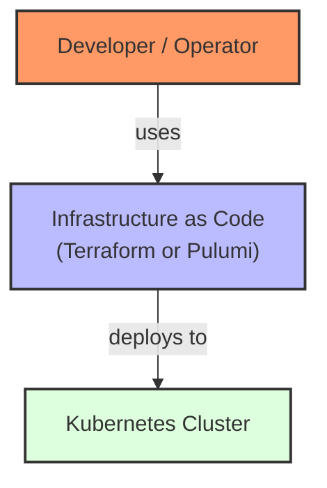
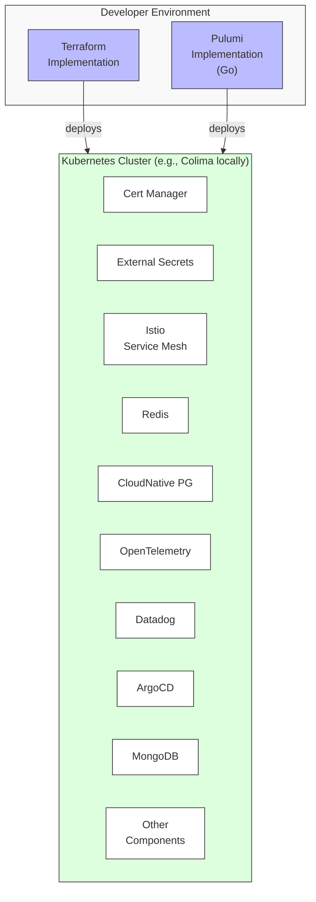
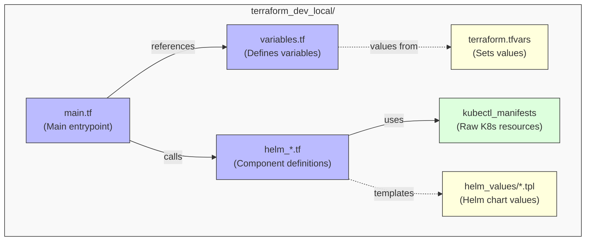
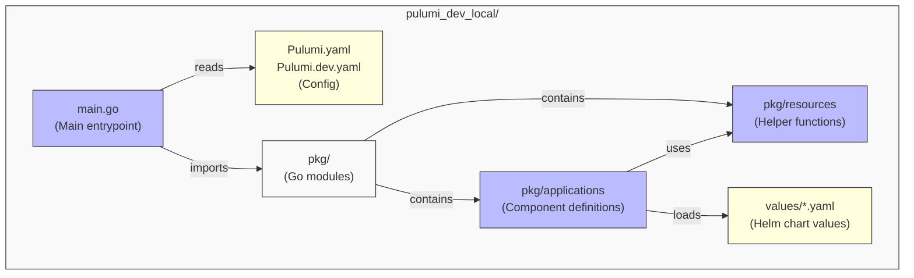

# Infrastructure as Code: Terraform vs Pulumi Implementation Comparison

## Introduction

This document provides a comprehensive analysis of the two Infrastructure as Code (IaC) implementations in this repository:
- Terraform (`terraform_dev_local/`)
- Pulumi (`pulumi_dev_local/`)

The purpose is to help newcomers understand the high-level architecture, implementation patterns, differences, and similarities between the two approaches. Both implementations deploy the same components to Kubernetes using Helm charts, but they use different tooling paradigms.

## System Context (C4 Level 1)

### Text-based C4 Diagram

```
┌─────────────────────────────────────┐
│                                     │
│       Developer / Operator          │
│                                     │
└───────────────┬─────────────────────┘
                │
                │ uses
                ▼
┌─────────────────────────────────────┐     deploys to     ┌─────────────────────┐
│                                     │                    │                     │
│ Infrastructure as Code              ├──────────────────►│  Kubernetes         │
│ (Terraform or Pulumi)               │                    │  Cluster            │
│                                     │                    │                     │
└─────────────────────────────────────┘                    └─────────────────────┘
```

### Mermaid Diagram



## Container Diagram (C4 Level 2)

### Text-based C4 Diagram

```
┌─────────────────────────────────────────────────────────────────────────────┐
│                                                                             │
│  Developer Environment                                                      │
│                                                                             │
│  ┌─────────────────┐         ┌─────────────────┐                            │
│  │                 │         │                 │                            │
│  │  Terraform      │         │  Pulumi         │                            │
│  │  Implementation │         │  Implementation │                            │
│  │                 │         │  (Go)           │                            │
│  └────────┬────────┘         └────────┬────────┘                            │
│           │                           │                                     │
└───────────┼───────────────────────────┼─────────────────────────────────────┘
            │                           │
            │ deploys                   │ deploys
            ▼                           ▼
┌─────────────────────────────────────────────────────────────────────────────┐
│                                                                             │
│  Kubernetes Cluster (e.g., Colima locally)                                  │
│                                                                             │
│  ┌────────────┐ ┌────────────┐ ┌────────────┐ ┌────────────┐ ┌────────────┐ │
│  │            │ │            │ │            │ │            │ │            │ │
│  │ Cert       │ │ External   │ │ Istio      │ │ Redis      │ │ CloudNative│ │
│  │ Manager    │ │ Secrets    │ │ Service    │ │            │ │ PG         │ │
│  │            │ │            │ │ Mesh       │ │            │ │            │ │
│  └────────────┘ └────────────┘ └────────────┘ └────────────┘ └────────────┘ │
│                                                                             │
│  ┌────────────┐ ┌────────────┐ ┌────────────┐ ┌────────────┐ ┌────────────┐ │
│  │            │ │            │ │            │ │            │ │            │ │
│  │ OpenTelem- │ │ Datadog    │ │ ArgoCD     │ │ MongoDB    │ │ Other      │ │
│  │ etry       │ │            │ │            │ │            │ │ Components │ │
│  │            │ │            │ │            │ │            │ │            │ │
│  └────────────┘ └────────────┘ └────────────┘ └────────────┘ └────────────┘ │
│                                                                             │
└─────────────────────────────────────────────────────────────────────────────┘
```

### Mermaid Diagram



## Component Diagram (C4 Level 3)

### Terraform Implementation Structure

#### Text-based C4 Diagram

```
┌─────────────────────────────────────────────────────────────────────────────┐
│                                                                             │
│  terraform_dev_local/                                                       │
│                                                                             │
│  ┌───────────────┐     ┌───────────────┐     ┌───────────────┐             │
│  │               │     │               │     │               │             │
│  │  variables.tf │◄────┤  main.tf      │────►│  helm_*.tf    │             │
│  │  (Defines     │     │  (Main        │     │  (Component   │             │
│  │   variables)  │     │   entrypoint) │     │   definitions)│             │
│  └───────────────┘     └───────────────┘     └───────┬───────┘             │
│                                                      │                      │
│                                                      │                      │
│  ┌───────────────┐     ┌───────────────┐     ┌───────▼───────┐             │
│  │               │     │               │     │               │             │
│  │terraform.tfvars│    │helm_values/*.tpl│   │kubectl_manifests│            │
│  │  (Sets        │    │  (Helm chart   │   │  (Raw K8s      │            │
│  │   values)     │    │   values)      │   │   resources)   │            │
│  └───────────────┘    └───────────────┘    └───────────────┘            │
│                                                                            │
└────────────────────────────────────────────────────────────────────────────┘
```

#### Mermaid Diagram



### Pulumi Implementation Structure

#### Text-based C4 Diagram

```
┌─────────────────────────────────────────────────────────────────────────────┐
│                                                                             │
│  pulumi_dev_local/                                                          │
│                                                                             │
│  ┌───────────────┐     ┌───────────────┐     ┌───────────────┐             │
│  │               │     │               │     │               │             │
│  │ Pulumi.yaml   │◄────┤  main.go      │────►│  pkg/         │             │
│  │ Pulumi.dev.yaml│    │  (Main        │     │  (Go modules) │             │
│  │ (Config)      │     │   entrypoint) │     │               │             │
│  └───────────────┘     └───────────────┘     └───────┬───────┘             │
│                                                      │                      │
│                                                      ▼                      │
│  ┌───────────────┐     ┌───────────────┐     ┌───────────────┐             │
│  │               │     │               │     │               │             │
│  │  values/*.yaml│     │pkg/applications│    │ pkg/resources │             │
│  │  (Helm chart  │◄────┤ (Component    │────►│ (Helper       │             │
│  │   values)     │     │  definitions) │     │  functions)   │             │
│  └───────────────┘     └───────────────┘     └───────────────┘             │
│                                                                            │
└────────────────────────────────────────────────────────────────────────────┘
```

#### Mermaid Diagram



## Key Implementation Comparison

### Configuration Management

| Aspect | Terraform | Pulumi |
|--------|-----------|--------|
| **Config Files** | `variables.tf`, `terraform.auto.tfvars` | `Pulumi.yaml`, `Pulumi.dev.yaml` |
| **Variable Definition** | HCL with types, descriptions, defaults | YAML key-value pairs |
| **Config Access** | Direct variable reference (`var.xyz`) | Helper function (`utils.NewConfig(ctx).GetString("xyz")`) |
| **Secret Handling** | Sensitive attributes, separate `.tfvars` files | Built-in secret encryption in `Pulumi.dev.yaml` |

### Component Deployment Pattern

#### Terraform Pattern

```hcl
# terraform_dev_local/helm_redis.tf

resource "helm_release" "redis" {
  count            = var.redis_enabled ? 1 : 0
  name             = "redis"
  repository       = "oci://registry-1.docker.io/bitnamicharts"
  chart            = "redis"
  version          = "18.19.1"
  namespace        = "redis"
  create_namespace = true
  wait             = true
  timeout          = 600

  values = [
    templatefile(
      "${path.module}/helm_values/redis_values.yaml.tpl",
      {
        namespace = "redis"
      }
    )
  ]

  set {
    name  = "auth.password"
    value = var.redis_password
  }
}
```

#### Pulumi Pattern

```go
// pulumi_dev_local/pkg/applications/redis.go

func DeployRedis(ctx *pulumi.Context, provider *kubernetes.Provider) (pulumi.Resource, error) {
    // Use config utils implementation
    cfg := utils.NewConfig(ctx)

    // Get Redis password from config
    redisPassword := cfg.GetString("redis_password", "redis-password")

    // Create Redis chart resource using the resources package
    return resources.DeployHelmChart(ctx, provider, resources.HelmChartConfig{
        Name:            "redis",
        ChartName:       "redis",
        Version:         cfg.GetString("redis_version", "18.19.1"),
        RepositoryURL:   "https://charts.bitnami.com/bitnami",
        Namespace:       "redis",
        CreateNamespace: true,
        ValuesFile:      "redis", // Will load values/redis.yaml
        // Only override values that come from configuration
        Values: map[string]interface{}{
            "auth": map[string]interface{}{
                "password": redisPassword,
            },
        },
        Wait:    true,
        Timeout: 1200,
    })
}
```

### Dependency Management

#### Terraform Approach

```hcl
# Dependencies in terraform_dev_local/helm_istio.tf

resource "helm_release" "istiod" {
  count            = var.istio_enabled ? 1 : 0
  # ... other configuration ...
  
  depends_on = [helm_release.istio_base, helm_release.istio_cni]
}

resource "kubernetes_manifest" "rate_limit_service" {
  count = var.istio_enabled && var.redis_enabled ? 1 : 0
  # ... manifest definition ...
  
  depends_on = [helm_release.istio_ingressgateway, helm_release.redis]
}
```

#### Pulumi Approach

```go
// Dependencies in pulumi_dev_local/pkg/applications/istio.go

// Deploy Istio istiod control plane
istiod, err := resources.DeployHelmChart(ctx, provider, resources.HelmChartConfig{
    // ... configuration ...
}, pulumi.DependsOn([]pulumi.Resource{istioBase, istioCNI}))

// Deploy rate limiting EnvoyFilters if Redis is enabled
if redisEnabled {
    // Rate Limit Service EnvoyFilter
    _, err = resources.CreateK8sManifest(ctx, provider, resources.K8sManifestConfig{
        // ... configuration ...
    }, pulumi.DependsOn([]pulumi.Resource{istioIngressGateway, redisResource}))
}
```

## Implementation Analysis

### High-Level Design Consistency

* **Helm Usage:** Both implementations consistently use Helm as the primary mechanism for deploying components. Terraform uses the `hashicorp/helm` provider's `helm_release` resource, while Pulumi uses a custom `resources.DeployHelmChart` function to wrap the Pulumi Kubernetes Helm resource.

* **Values Management:** Both approaches externalize Helm values. Terraform uses `.yaml.tpl` files in `helm_values/` processed with `templatefile()`, while Pulumi uses plain `.yaml` files in `values/` referenced by name, with selective overrides applied programmatically.

* **Component Enablement:** Both use similar patterns for enabling/disabling components via configuration flags. Terraform uses `count = var.<component>_enabled ? 1 : 0`, while Pulumi uses `if` conditions based on boolean values read from configuration.

* **Version Pinning:** Both implementations pin Helm chart versions in their respective configuration files, which is good practice for reproducibility.

### Identified Inconsistencies

1. **Redis Helm Repository URL:** 
   * Terraform: `oci://registry-1.docker.io/bitnamicharts`
   * Pulumi: `https://charts.bitnami.com/bitnami`
   * **Recommendation:** Standardize on `https://charts.bitnami.com/bitnami` for both implementations for consistency with the infrastructure-as-code guidelines that prefer HTTPS URLs.

2. **Timeout Values:**
   * Terraform Redis: `timeout = 600`
   * Pulumi Redis: `Timeout: 1200`
   * **Recommendation:** Standardize timeout values across implementations to ensure consistent behavior.

3. **Configuration Structure:**
   * While both implementations serve the same purpose, Terraform's nested HCL structure differs from Pulumi's flat YAML configuration keys. This might lead to subtle inconsistencies in how values are defined and reference.
   * **Recommendation:** Document the mapping between Terraform variables and Pulumi configuration keys.

### Strengths and Tradeoffs

#### Terraform Strengths
- Declarative HCL syntax that clearly defines resources and relationships
- More established ecosystem with broad provider support
- Simpler learning curve for infrastructure engineers familiar with other HashiCorp tools

#### Pulumi Strengths
- General-purpose programming language (Go) with full access to language features
- Object-oriented paradigm allows more advanced abstraction and reuse
- Better ability to encapsulate complex logic within code
- Native integration with application code when applicable

## Best Practices for Maintaining Parity

1. **Version Synchronization:**
   * Always update component versions in both `terraform.auto.tfvars` and `Pulumi.dev.yaml` simultaneously
   * Use explicit version pinning in both implementations

2. **Change Process:**
   * When adding new components, implement in both systems simultaneously
   * Test both implementations after significant changes
   * Document the implementation details in both `terraform_dev_local/docs/` and `pulumi_dev_local/docs/`

3. **Helm Values Management:**
   * Compare the effective values being applied by both systems
   * Ensure any templates or overrides produce equivalent results

4. **Documentation:**
   * Keep `COMPONENTS.md` files in sync between implementations
   * Document any known differences in behavior or implementation patterns

## Getting Started

### Terraform Workflow

```bash
cd terraform_dev_local
terraform init
terraform plan
terraform apply -auto-approve
terraform destroy -auto-approve  # When finished
```

### Pulumi Workflow

```bash
cd pulumi_dev_local
pulumi stack select dev
pulumi preview
pulumi up -y
pulumi destroy -y  # When finished
```

## Conclusion

The repository maintains two parallel IaC implementations that follow the same high-level architecture and deploy the same components. The different approaches offer valuable insights into IaC tool selection and design patterns. While there are some minor inconsistencies, the overall design philosophy is consistent and follows industry best practices for infrastructure as code.

Both implementations successfully demonstrate:
- Helm-based deployment of Kubernetes components
- Configuration externalization and parameterization
- Proper dependency management
- Component enablement flexibility
- Infrastructure component reusability

For newcomers to the repository, studying both implementations provides an excellent opportunity to understand different IaC approaches to the same architectural goals. 