# Template FastAPI Application - Design Documentation

This document provides a comprehensive overview of the Template FastAPI Application architecture, components, and integration points. It's intended for new developers who need to understand the system at a deeper technical level.

## Architecture Overview

### System Context

The following diagram shows the Template FastAPI Application in context with external systems and users:

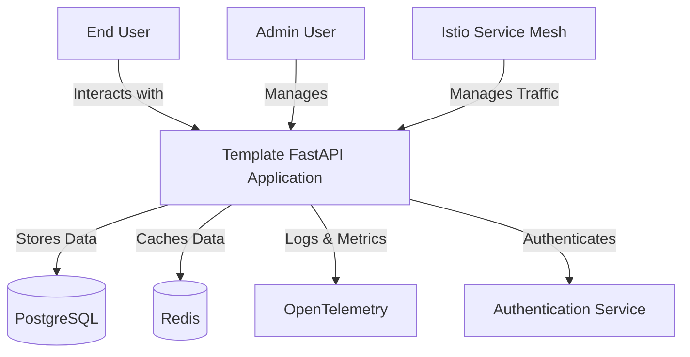

### Container Diagram

The following diagram breaks down the application into containers, showing how responsibilities are distributed:

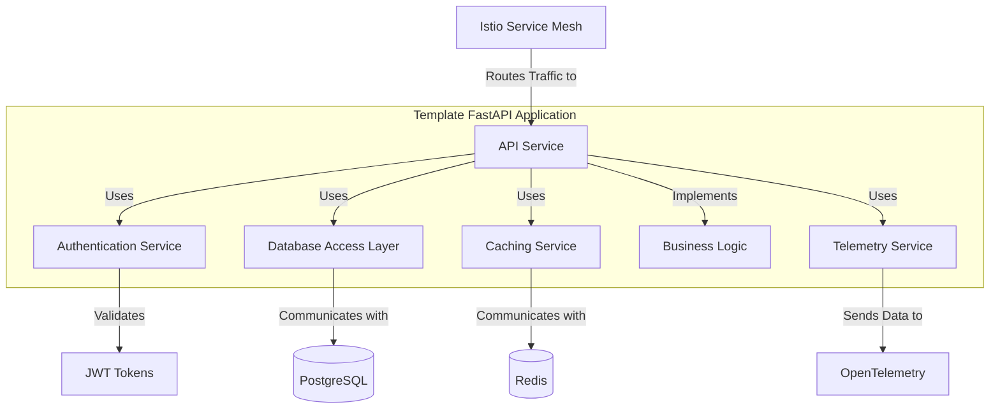

## Component Design

### API Service Components

The API service consists of the following key components:

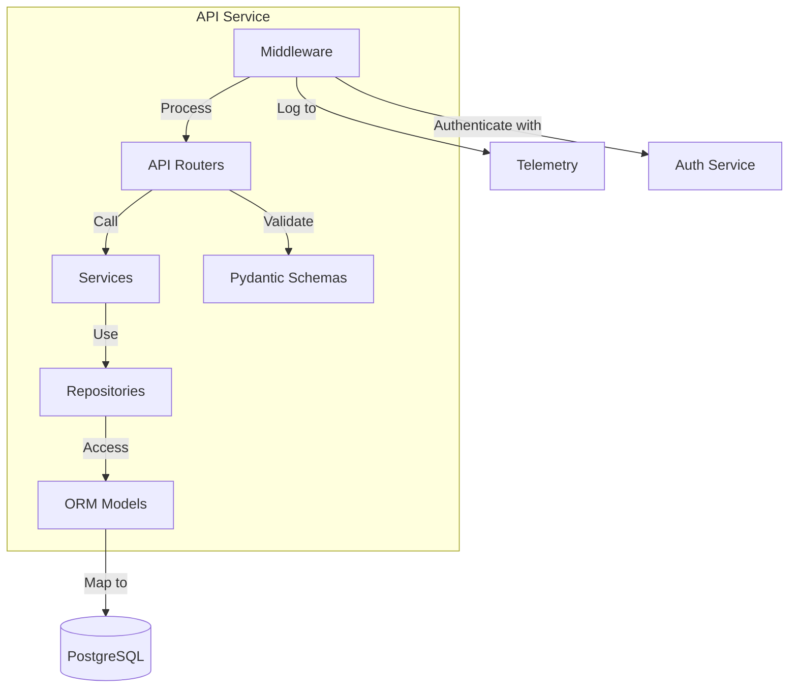

### Auth Service Components

The authentication service provides JWT-based authentication:

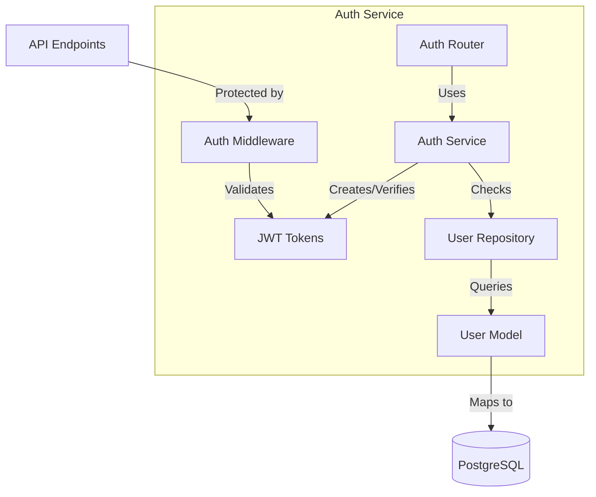

## Key Processes

### Authentication Flow

The authentication process follows these steps:

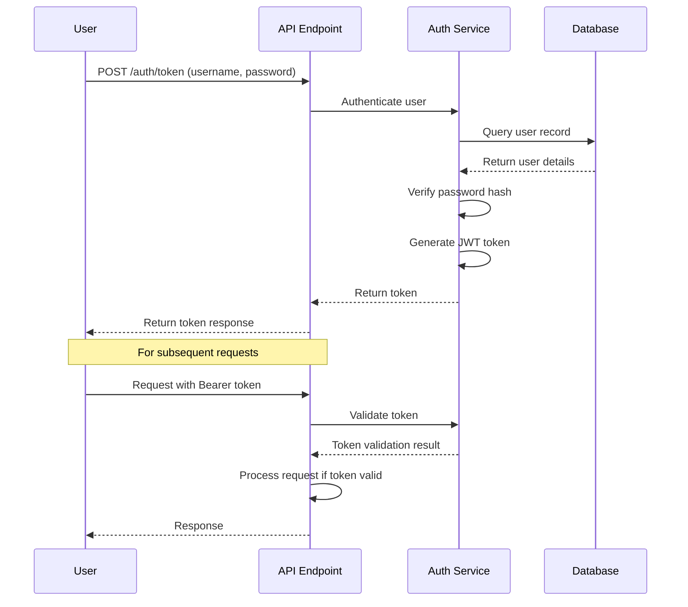

### Item Creation Process

The process of creating a new item:

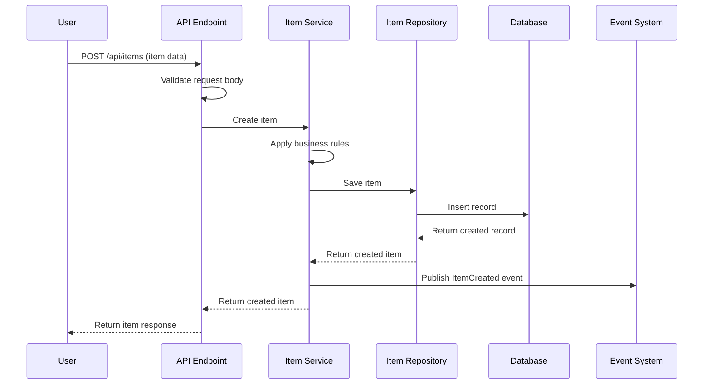

## Data Model

The application uses the following data model:

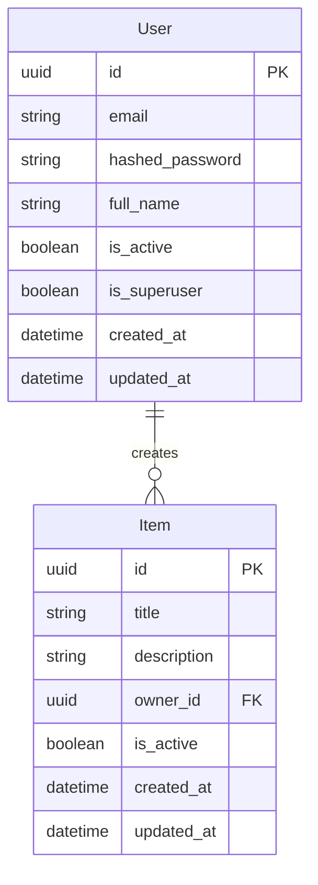

## API Endpoints

| Endpoint | Method | Description | Authentication |
|----------|--------|-------------|----------------|
| `/api/health` | GET | Health check endpoint | No |
| `/api/metrics` | GET | Prometheus metrics | No |
| `/api/docs` | GET | Swagger UI documentation | No |
| `/api/redoc` | GET | ReDoc documentation | No |
| `/api/auth/token` | POST | Get JWT token | No |
| `/api/users/me` | GET | Get current user | Yes |
| `/api/users/{user_id}` | GET | Get user by ID | Yes (Admin) |
| `/api/users/` | POST | Create new user | No |
| `/api/users/me` | PUT | Update current user | Yes |
| `/api/items/` | GET | List items | Yes |
| `/api/items/` | POST | Create new item | Yes |
| `/api/items/{item_id}` | GET | Get item by ID | Yes |
| `/api/items/{item_id}` | PUT | Update item | Yes (Owner/Admin) |
| `/api/items/{item_id}` | DELETE | Delete item | Yes (Owner/Admin) |

## Integration with Infrastructure

### Istio Integration

The application integrates with Istio as follows:

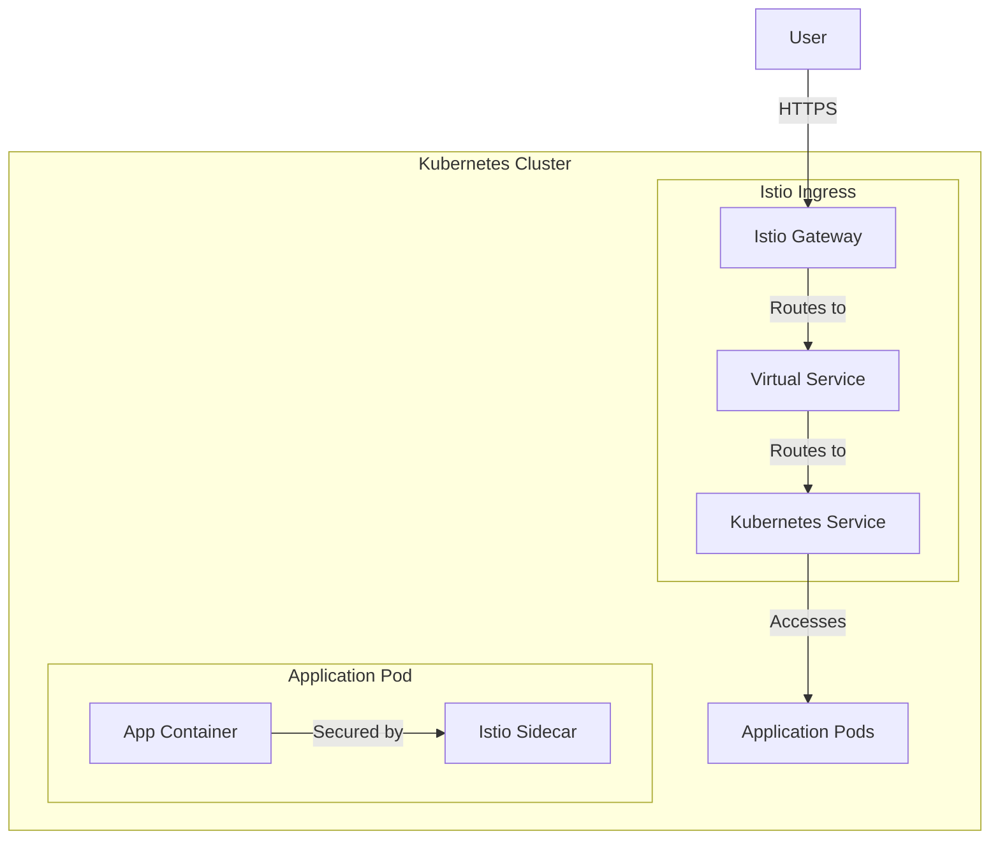

### PostgreSQL Integration

The application connects to PostgreSQL:

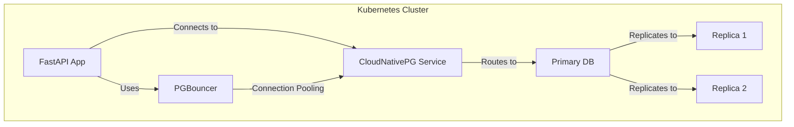

### OpenTelemetry Integration

The application uses OpenTelemetry for observability:

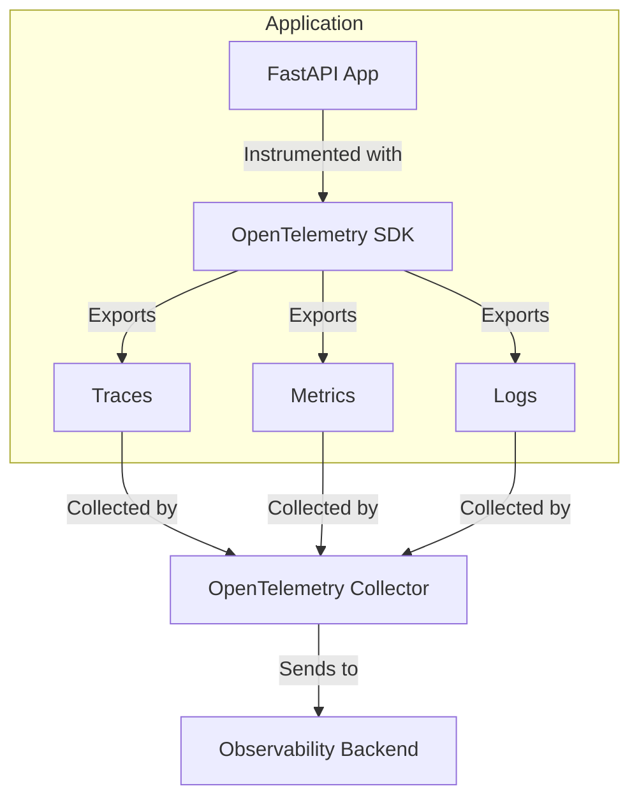

## Deployment Process

### Local Development Flow

The local development process uses Skaffold:

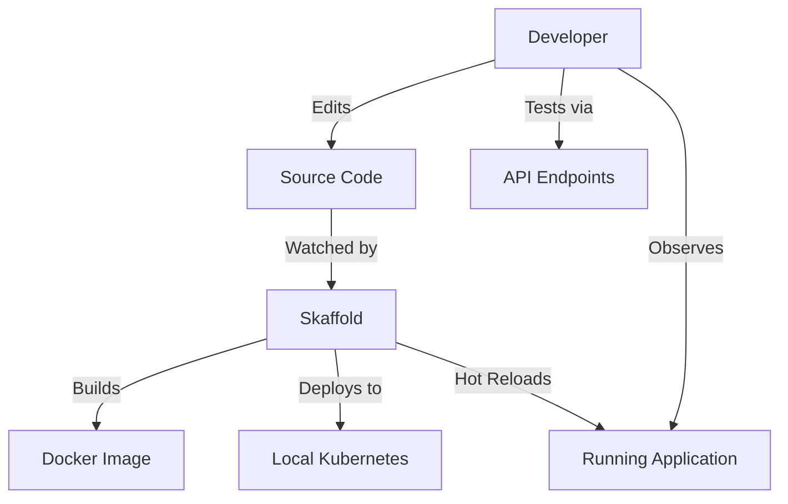

### CI/CD Pipeline

The continuous integration and delivery pipeline:

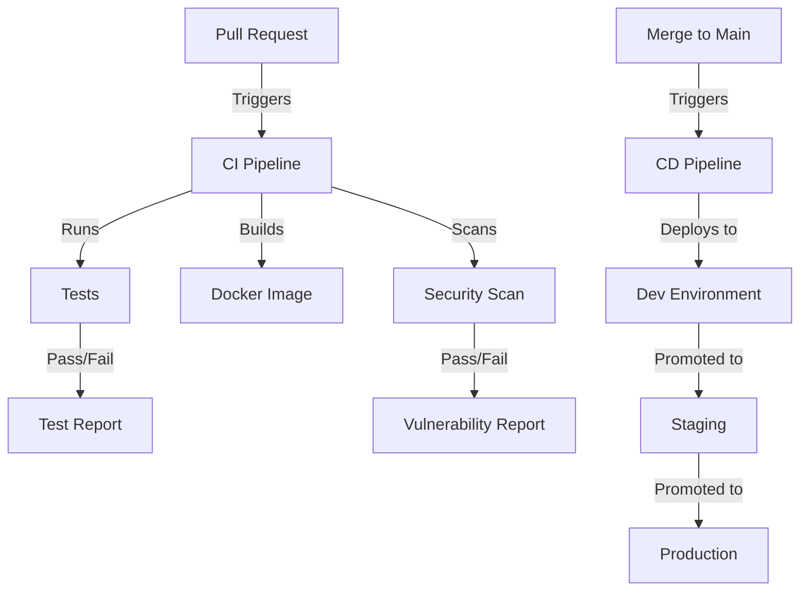

## Development Environment Setup

To set up a development environment:

1. **Prerequisites**:
   - Docker
   - Kubernetes (minikube, k3d, or Docker Desktop)
   - kubectl
   - Helm
   - Skaffold
   - Python 3.10+
   - Poetry

2. **Install dependencies**:
   ```bash
   poetry install
   ```

3. **Set up local Kubernetes**:
   ```bash
   # Start a local cluster
   colima start --cpu 4 --memory 8
   
   # Deploy infrastructure components
   cd infrastructure/terraform
   terraform init
   terraform apply
   ```

4. **Run the application**:
   ```bash
   # Start the application in development mode
   skaffold dev
   ```

## Testing Strategy

The application uses a layered testing approach:

1. **Unit Tests**: Test individual functions and methods in isolation
2. **Integration Tests**: Test interactions between components
3. **API Tests**: Test HTTP endpoints
4. **End-to-End Tests**: Test complete user journeys

To run tests:

```bash
# Run unit tests
pytest tests/unit

# Run integration tests
pytest tests/integration

# Run API tests
pytest tests/api

# Run all tests
pytest
```

## Common Development Tasks

### Adding a New Endpoint

1. Create a new router or add to an existing one in `app/api/routes/`
2. Define Pydantic schemas in `app/schemas/`
3. Implement service logic in `app/services/`
4. Add database models if needed in `app/models/`
5. Add tests in the appropriate test directory

Example:

```python
# In app/api/routes/items.py
@router.post("/items/", response_model=schemas.Item)
def create_item(
    item_in: schemas.ItemCreate, 
    current_user: models.User = Depends(deps.get_current_user),
    db: Session = Depends(deps.get_db)
) -> Any:
    """Create a new item."""
    item = item_service.create_item(db, obj_in=item_in, owner_id=current_user.id)
    return item
```

### Adding a New Database Model

1. Create the model in `app/models/`
2. Create migrations using Alembic
3. Add Pydantic schemas in `app/schemas/`
4. Implement repository functions in `app/repositories/`

Example:

```python
# In app/models/item.py
class Item(Base):
    id = Column(UUID(as_uuid=True), primary_key=True, default=uuid.uuid4)
    title = Column(String, index=True)
    description = Column(String)
    owner_id = Column(UUID(as_uuid=True), ForeignKey("user.id"))
    created_at = Column(DateTime, default=datetime.utcnow)
    updated_at = Column(DateTime, default=datetime.utcnow, onupdate=datetime.utcnow)
```

### Adding a New Configuration Variable

1. Add the variable to `.env.example`
2. Update `app/core/config.py` with the new setting
3. Update Kubernetes ConfigMap in `kubernetes/templates/configmap.yaml`

### Adding a New Dependency

1. Add the dependency to `pyproject.toml`
2. Update the dependency using Poetry:
   ```bash
   poetry add <dependency>
   ```
3. Update the Docker image to include the new dependency

## Configuration Reference

The application uses the following configuration variables:

| Variable | Description | Default |
|----------|-------------|---------|
| `POSTGRES_SERVER` | PostgreSQL server hostname | `localhost` |
| `POSTGRES_USER` | PostgreSQL username | `postgres` |
| `POSTGRES_PASSWORD` | PostgreSQL password | - |
| `POSTGRES_DB` | PostgreSQL database name | `app` |
| `REDIS_HOST` | Redis server hostname | `localhost` |
| `REDIS_PORT` | Redis server port | `6379` |
| `SECRET_KEY` | Secret key for JWT encoding | - |
| `ACCESS_TOKEN_EXPIRE_MINUTES` | JWT token expiration time | `30` |
| `BACKEND_CORS_ORIGINS` | CORS allowed origins | `["http://localhost"]` |
| `ENVIRONMENT` | Environment name | `development` |
| `LOG_LEVEL` | Logging level | `INFO` |

## Code Organization

```
app/
├── api/                 # API endpoints
│   ├── deps.py          # Dependency injection
│   └── routes/          # API route definitions
├── core/                # Core functionality
│   ├── config.py        # Configuration handling
│   └── security.py      # Security utilities
├── db/                  # Database setup
│   └── session.py       # Database session management
├── models/              # SQLAlchemy ORM models
├── repositories/        # Data access layer
├── schemas/             # Pydantic models for API
├── services/            # Business logic
└── main.py              # Application entry point

tests/                   # Test suite
├── unit/                # Unit tests
├── integration/         # Integration tests
└── api/                 # API tests

migrations/              # Alembic migrations

kubernetes/              # Kubernetes manifests
├── templates/           # Kubernetes resource templates
└── values.yaml          # Deployment values

infrastructure/          # Infrastructure setup
├── terraform/           # Terraform modules
└── pulumi/              # Pulumi configurations
```

## Performance Considerations

The application is designed for high performance:

1. **Asynchronous Processing**: Uses FastAPI's async capabilities for non-blocking I/O
2. **Connection Pooling**: Uses PgBouncer for efficient database connections
3. **Caching**: Implements Redis caching for frequently accessed data
4. **Pagination**: All list endpoints use pagination to limit response size
5. **Database Indexes**: Strategic indexes on frequently queried fields
6. **Optimized Queries**: Efficient SQL queries with proper joins and filtering
7. **Resource Limits**: Kubernetes resource requests and limits to prevent resource starvation

## Security Considerations

The application implements several security measures:

1. **Input Validation**: All inputs validated using Pydantic
2. **Authentication**: JWT-based authentication with proper secret key management
3. **Authorization**: RBAC for protected endpoints
4. **Password Hashing**: Secure password hashing with bcrypt
5. **Rate Limiting**: Rate limiting to prevent abuse
6. **HTTPS**: All traffic encrypted using TLS
7. **CORS**: Proper CORS configuration
8. **Dependency Updates**: Regular updates for security patches

## Error Handling

The application uses a structured approach to error handling:

1. **HTTP Exceptions**: FastAPI HTTP exceptions for client errors
2. **Application Exceptions**: Custom exception classes for application errors
3. **Global Exception Handler**: Centralized exception handling
4. **Structured Error Responses**: Consistent error response format
5. **Logging**: Comprehensive error logging

## Logging and Monitoring

The application uses a structured logging approach:

1. **Structured JSON Logs**: All logs in JSON format
2. **Correlation IDs**: Request correlation IDs for tracing
3. **Log Levels**: Appropriate log levels for different environments
4. **Metrics**: Key performance metrics exported to Prometheus
5. **Traces**: Distributed tracing using OpenTelemetry
6. **Alerts**: Alerting rules for critical conditions

## Additional Resources

For more information, refer to:

- [Developer Quickstart](developer-quickstart.md) - Quick setup guide
- [Architecture Overview](architecture-overview.md) - High-level architecture overview
- [API Documentation](http://localhost:8000/api/docs) - Swagger UI documentation
- [FastAPI Documentation](https://fastapi.tiangolo.com/) - FastAPI framework documentation 